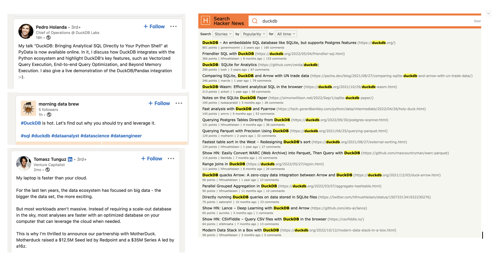
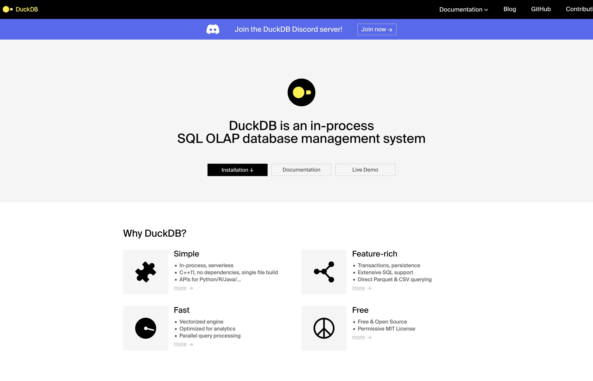
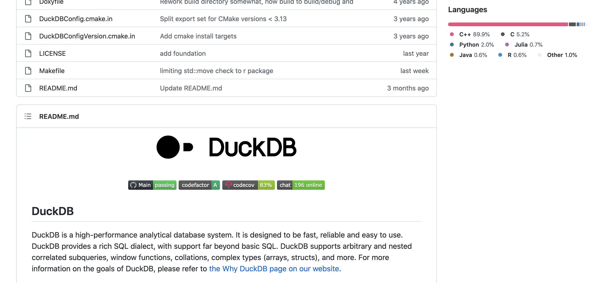
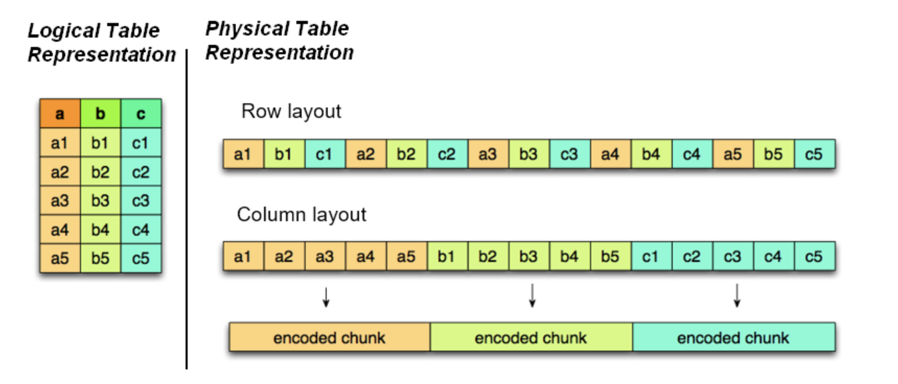
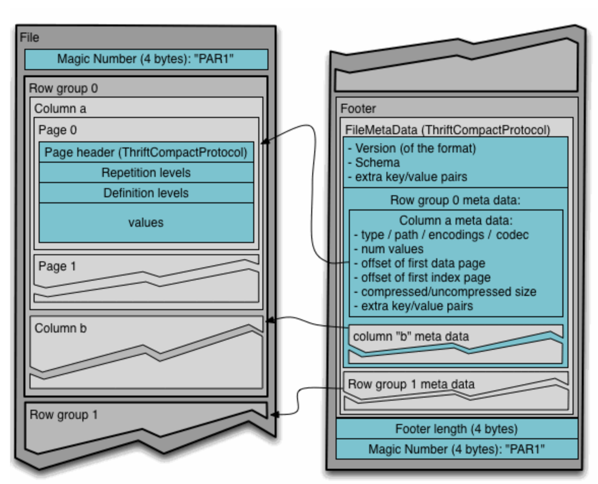
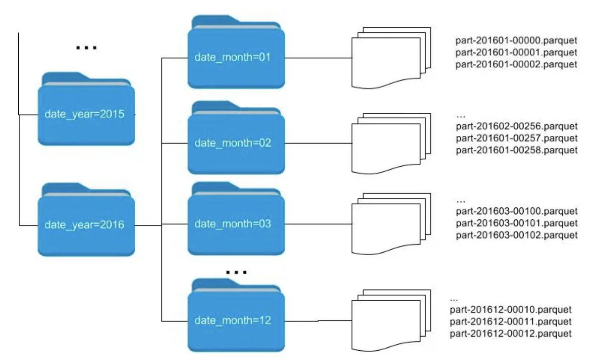
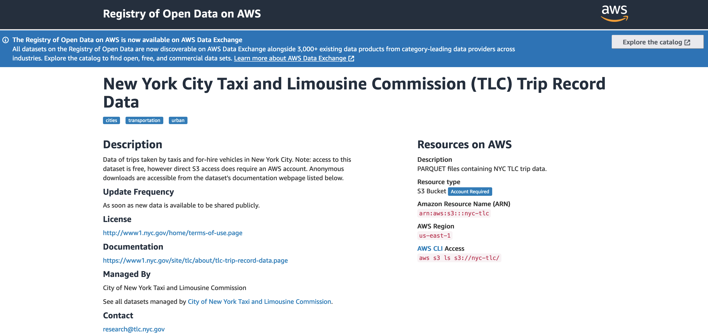

<!-- _class: lead -->
### DuckDB - What's all the hype!

##### An intro to using DuckDB with Python


###### https://ap76ap.github.io/thaipy-duckdb/slides/


---
<!-- _header: agenda -->

- About Me
- DuckDB - What is it?
- Install DuckDB
- Level 1 : CSV
- Data Lake Storage - Super Quick Primer
- Level 2 : Parquet
- Level 3 : Parquet - against Cloud Storage
- Level 4 : Data Lake Engine

---
<!-- _backgroundColor: white -->


---
<!-- _backgroundColor: white -->
<!-- _header: DuckDB - What is it? -->


---
<!-- _backgroundColor: white -->
<!-- _header: DuckDB-->




---


<!-- _class: lead -->

### let's get it installed and take a look and kick the tyres!


---

<!-- _header: install -->
``` bash

pip install duckdb

Collecting duckdb
  Downloading 
  duckdb-0.6.1-cp310-cp310-macosx_10_9_x86_64.whl (13.6 MB)
   ━━━━━━━━━━━━━━━━━━━━━━━━━━━━━━━━━━━━━━━━ 
   13.6/13.6 MB 2.5 MB/s eta 0:00:00

Requirement already satisfied: numpy>=1.14 in 
site-packages (from duckdb) (1.24.1)

Installing collected packages: duckdb
Successfully installed duckdb-0.6.1

```
---
<!-- _header: run from python -->
The simplest Python Example.

``` python

import duckdb
cursor = duckdb.connect()

print(cursor.execute('SELECT 42').fetchall())
[(42,)]

```
---
<!-- _header: Titanic  -->
<!-- _footer: From: https://www.kaggle.com/c/titanic -->
<!-- _backgroundColor: white -->


---
<!-- _header: level one -->

``` python
rowset = cursor.execute("SELECT COUNT(*) FROM './data/train.csv';")
rowset.fetchall()
[(891,)]
```

``` python
rowset = cursor.execute("SELECT * FROM './data/train.csv' LIMIT 1;")
rowset.fetchall()
[(1,
  0,
  3,
  'Braund, Mr. Owen Harris',
  'male',
  22.0,
  1,
  0,
  'A/5 21171',
  7.25,
  None,
  'S')]
```
---
<!-- _header: level one --><!-- _header: level one -->
``` python
rowset.description
[('PassengerId', 'NUMBER', None, None, None, None, None),
 ('Survived', 'NUMBER', None, None, None, None, None),
 ('Pclass', 'NUMBER', None, None, None, None, None),
 ('Name', 'STRING', None, None, None, None, None),
 ('Sex', 'STRING', None, None, None, None, None),
 ('Age', 'NUMBER', None, None, None, None, None),
 ('SibSp', 'NUMBER', None, None, None, None, None),
 ('Parch', 'NUMBER', None, None, None, None, None),
 ('Ticket', 'STRING', None, None, None, None, None),
 ('Fare', 'NUMBER', None, None, None, None, None),
 ('Cabin', 'STRING', None, None, None, None, None),
 ('Embarked', 'STRING', None, None, None, None, None)]
```
```
rowset.fetch_df()
   PassengerId  Survived  Pclass                     Name   Sex   Age  SibSp  Parch     Ticket  Fare Cabin Embarked
0            1         0       3  Braund, Mr. Owen Harris  male  22.0      1      0  A/5 21171  7.25   NaN        S
```
---
<!-- _header: level one -->
``` python 
sql = """
SELECT 
  Name,
  Age,
  Sex,
  Fare,
  Survived
FROM
  './data/train.csv'
ORDER BY
  Fare DESC
LIMIT 10
"""

rowset = cursor.execute(sql)
rowset.fetch_df()
                                    Name   Age     Sex      Fare  Survived
0                       Ward, Miss. Anna  35.0  female  512.3292         1
1     Cardeza, Mr. Thomas Drake Martinez  36.0    male  512.3292         1
2                 Lesurer, Mr. Gustave J  35.0    male  512.3292         1
3         Fortune, Mr. Charles Alexander  19.0    male  263.0000         0
4             Fortune, Miss. Mabel Helen  23.0  female  263.0000         1
5         Fortune, Miss. Alice Elizabeth  24.0  female  263.0000         1
6                      Fortune, Mr. Mark  64.0    male  263.0000         0
7             Ryerson, Miss. Emily Borie  18.0  female  262.3750         1
8  Ryerson, Miss. Susan Parker "Suzette"  21.0  female  262.3750         1
9               Baxter, Mr. Quigg Edmond  24.0    male  247.5208         0
```
---

<!-- _footer: From: https://www.encyclopedia-titanica.org/titanic-survivor/annie-moore-ward.html -->

<!-- _backgroundColor: white -->


---

<!-- _class: lead -->

### Super Quick Data Lake Storage Primer


---

<!-- _header: Columnar Data -->
<!-- _footer: From: https://datacadamia.com/data/type/relation/structure/column_store -->

<!-- _backgroundColor: white -->


---
<!-- _header: Parquet Format -->
<!-- _footer: From: https://parquet.apache.org/docs/file-format/ -->

<!-- _backgroundColor: white -->


---
<!-- _header: Partitioning -->
<!-- _footer: From: https://www.datio.com/iaas/understanding-the-data-partitioning-technique/ -->

<!-- _backgroundColor: white -->


---

<!-- _header: NYC Taxi Data -->
<!-- _footer: From: https://registry.opendata.aws/nyc-tlc-trip-records-pds/-->

<!-- _backgroundColor: white -->




``` bash
aws s3 ls "s3://nyc-tlc/"

2022-05-12 21:55:45   21381938 trip data/yellow_tripdata_2020-09.parquet
2022-05-12 21:55:45   26306876 trip data/yellow_tripdata_2020-10.parquet
2022-05-12 21:55:45   23583368 trip data/yellow_tripdata_2020-11.parquet
2022-05-12 21:55:45   23020036 trip data/yellow_tripdata_2020-12.parquet
2022-05-12 21:55:45   21686067 trip data/yellow_tripdata_2021-01.parquet
2022-05-12 21:55:45   21777258 trip data/yellow_tripdata_2021-02.parquet
2022-05-12 21:55:45   30007852 trip data/yellow_tripdata_2021-03.parquet


```
---
<!-- _header: level two -->

``` python
sql = """
SELECT 
  COUNT(*) 
FROM 
  './data/yellow_tripdata_2022-10.parquet';
"""
rowset = cursor.execute(sql)
rowset.fetchall()
[(3675411,)]
```
---

<!-- _header: level two -->

``` python
sql = """
SELECT 
  * 
FROM 
  './data/yellow_tripdata_2022-10.parquet'
LIMIT 1;
"""
rowset = cursor.execute(sql)
rowset.description
[('VendorID', 'NUMBER', None, None, None, None, None),
 ('tpep_pickup_datetime', 'DATETIME', None, None, None, None, None),
 ('tpep_dropoff_datetime', 'DATETIME', None, None, None, None, None),
 ('passenger_count', 'NUMBER', None, None, None, None, None),
 ('trip_distance', 'NUMBER', None, None, None, None, None),
 ('RatecodeID', 'NUMBER', None, None, None, None, None),
 ('store_and_fwd_flag', 'STRING', None, None, None, None, None),
 ('PULocationID', 'NUMBER', None, None, None, None, None),
 ('DOLocationID', 'NUMBER', None, None, None, None, None),
 ('payment_type', 'NUMBER', None, None, None, None, None),
 ('fare_amount', 'NUMBER', None, None, None, None, None),
 ('extra', 'NUMBER', None, None, None, None, None),
 ('mta_tax', 'NUMBER', None, None, None, None, None),
 ('tip_amount', 'NUMBER', None, None, None, None, None),
 ('tolls_amount', 'NUMBER', None, None, None, None, None),
 ('improvement_surcharge', 'NUMBER', None, None, None, None, None),
 ('total_amount', 'NUMBER', None, None, None, None, None),
 ('congestion_surcharge', 'NUMBER', None, None, None, None, None),
 ('airport_fee', 'NUMBER', None, None, None, None, None)]
```
---

``` python
sql = """
    SELECT
    DATE_PART('hour', tpep_pickup_datetime) as dropoff_hour,
    COUNT(*) as trip_count,
    ROUND(SUM(fare_amount) / COUNT(*), 2) as avg_fare_amount,
    ROUND(100 * (SUM(tip_amount) / SUM(fare_amount)), 2) as avg_tip_pct
    FROM
    './data/yellow_tripdata_2022-10.parquet'
    GROUP BY
    1
    ORDER BY
    dropoff_hour
"""
rowset = cursor.execute(sql)
print(rowset.fetch_df().to_markdown())
```
---
<style scoped>section { font-size: 14px; }</style>

|    |   dropoff_hour |   trip_count |   avg_fare_amount |   avg_tip_pct |
|---:|---------------:|-------------:|------------------:|--------------:|
|  0 |              0 |       107210 |             15.62 |         18.61 |
|  1 |              1 |        71720 |             13.84 |         19.15 |
|  2 |              2 |        50726 |             13.34 |         18.94 |
|  3 |              3 |        33938 |             14.14 |         18.26 |
|  4 |              4 |        22468 |             18.73 |         17.17 |
|  5 |              5 |        23985 |             22.22 |         16.67 |
|  6 |              6 |        55190 |             18.45 |         17.17 |
|  7 |              7 |       105110 |             15.6  |         18.29 |
|  8 |              8 |       139141 |             15.27 |         18.51 |
|  9 |              9 |       156717 |             14.5  |         18.51 |
| 10 |             10 |       173381 |             14.42 |         18.28 |
| 11 |             11 |       187832 |             14.68 |         18.3  |
| 12 |             12 |       198638 |             15.15 |         18.08 |
| 13 |             13 |       200519 |             15.99 |         17.95 |
| 14 |             14 |       213367 |             16.36 |         17.96 |
| 15 |             15 |       221032 |             16.54 |         18.06 |
| 16 |             16 |       223512 |             16.53 |         18.66 |
| 17 |             17 |       248394 |             15.36 |         19.17 |
| 18 |             18 |       254694 |             14.49 |         19.59 |
| 19 |             19 |       239130 |             14.07 |         19.62 |
| 20 |             20 |       213405 |             14.24 |         19.5  |
| 21 |             21 |       202483 |             14.58 |         19.55 |
| 22 |             22 |       183706 |             15.41 |         19.38 |
| 23 |             23 |       149113 |             16.07 |         18.84 |

---
<!-- _header: level three -->

``` python
import duckdb
cursor = duckdb.connect()
cursor.execute("INSTALL httpfs;")
cursor.execute("LOAD httpfs;")
cursor.execute("SET s3_region='{aws-region-code}';")
cursor.execute("SET s3_access_key_id='****************';")
cursor.execute("SET s3_secret_access_key='**********************';")

```

``` python
sql = """
SELECT 
  COUNT(*) 
FROM 
  read_parquet('s3://is-sd-z001/nyctaxi/year=2022/month=10/yellow_tripdata_2022-10.parquet')
  ;
"""
rowset = cursor.execute(sql)
rowset.fetchall()
[(3675411,)]
```
---
``` python
sql = """
SELECT 
  COUNT(*) 
FROM 
  parquet_scan('s3://is-sd-z001/nyctaxi/year=*/month=*/*.parquet')
  ;
"""
rowset = cursor.execute(sql)
rowset.fetchall()
[(33003832,)]
```
---

``` python
sql = """
    SELECT
      DATE_PART('hour', tpep_pickup_datetime) as dropoff_hour,
      COUNT(*) as trip_count,
      ROUND(SUM(fare_amount) / COUNT(*), 2) as avg_fare_amount,
      ROUND(100 * (SUM(tip_amount) / SUM(fare_amount)), 2) as avg_tip_pct
    FROM
      parquet_scan('s3://is-sd-z001/nyctaxi/year=*/month=*/*.parquet')
    GROUP BY
      1
    ORDER BY
      dropoff_hour
"""
rowset = cursor.execute(sql)
print(rowset.fetch_df().to_markdown())
```

---
<style scoped>section { font-size: 14px; }</style>

|    |   dropoff_hour |       trip_count |   avg_fare_amount |   avg_tip_pct |
|---:|---------------:|-----------------:|------------------:|--------------:|
|  0 |              0 | 916905           |             15.41 |         18.49 |
|  1 |              1 | 602773           |             14.19 |         18.56 |
|  2 |              2 | 405248           |             13.45 |         18.5  |
|  3 |              3 | 267859           |             14.28 |         17.63 |
|  4 |              4 | 183428           |             18.84 |         16.7  |
|  5 |              5 | 210743           |             21.55 |         16.39 |
|  6 |              6 | 517720           |             17.24 |         16.98 |
|  7 |              7 | 958538           |             14.97 |         18.09 |
|  8 |              8 |      1.2736e+06  |             14.46 |         18.45 |
|  9 |              9 |      1.41934e+06 |             14.17 |         18    |
| 10 |             10 |      1.56194e+06 |             13.8  |         17.97 |
| 11 |             11 |      1.69816e+06 |             14.25 |         17.7  |
| 12 |             12 |      1.83514e+06 |             14.36 |         17.9  |
| 13 |             13 |      1.87048e+06 |             14.8  |         17.82 |
| 14 |             14 |      2.00555e+06 |             15.29 |         17.8  |
| 15 |             15 |      2.05901e+06 |             15.54 |         17.85 |
| 16 |             16 |      2.05026e+06 |             15.5  |         18.56 |
| 17 |             17 |      2.23669e+06 |             14.69 |         19.02 |
| 18 |             18 |      2.35226e+06 |             13.61 |         19.66 |
| 19 |             19 |      2.1173e+06  |             13.35 |         19.77 |
| 20 |             20 |      1.81635e+06 |             13.7  |         19.57 |
| 21 |             21 |      1.73885e+06 |             14.02 |         19.68 |
| 22 |             22 |      1.60565e+06 |             14.66 |         19.48 |
| 23 |             23 |      1.30004e+06 |             15.33 |         18.85 |
---